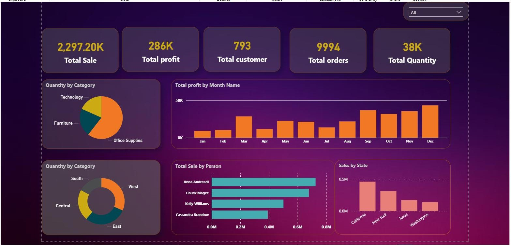
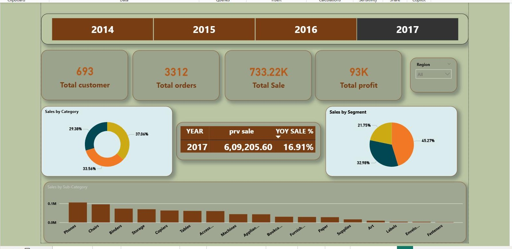
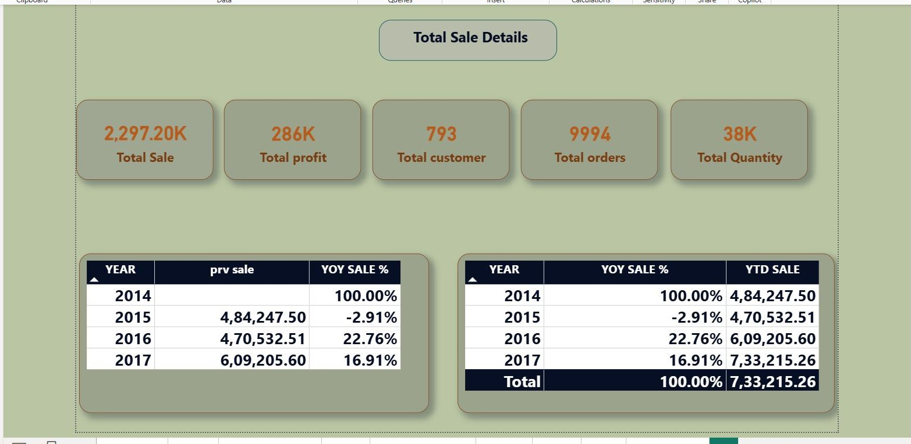
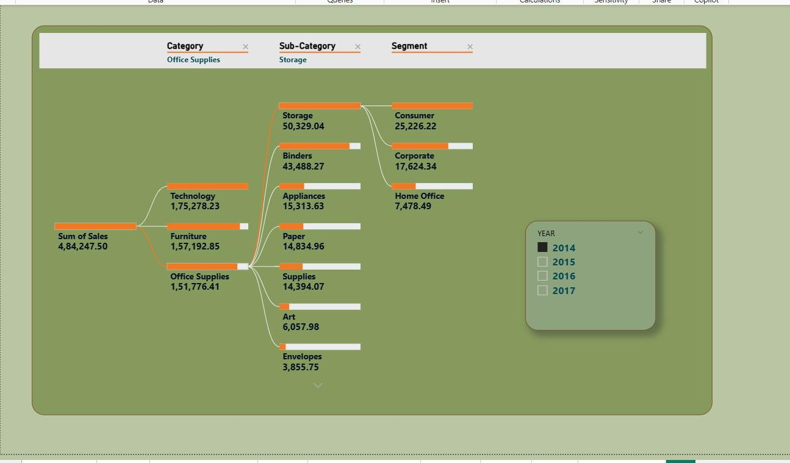
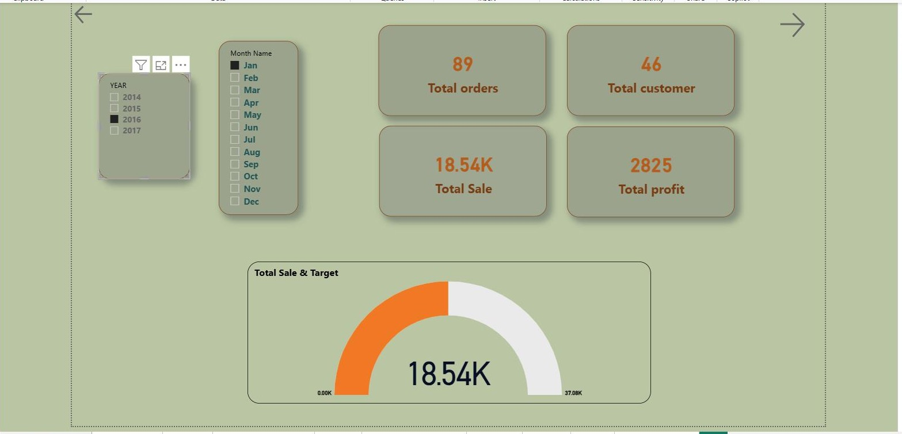

# Sales Performance & Business Intelligence Dashboard

## Project Overview

This is a personal Power BI portfolio project developed to analyze sales performance, profitability, customers, orders, and regional business performance.

The dashboard provides an interactive view of key business metrics and allows users to explore performance across different years, regions, categories, segments, products, and time periods.

## Key Objectives

- Analyze overall sales and profit performance
- Monitor key business KPIs
- Compare sales performance across years
- Analyze Year-over-Year (YoY) performance
- Analyze Year-to-Date (YTD) performance
- Identify monthly sales and profit trends
- Analyze category and segment performance
- Explore regional and state-level sales performance
- Analyze salesperson performance
- Identify factors contributing to overall sales performance

## Key KPIs

- Total Sales
- Total Profit
- Total Customers
- Total Orders
- Total Quantity
- Previous Year Sales
- YoY Sales %
- YTD Sales

## Dashboard Analysis

The report includes multiple analytical views covering:

- Executive Sales Overview
- Sales by Year and Region
- Sales by Category and Segment
- Sales by Sub-Category
- Monthly Sales and Profit Trends
- State and City-Level Sales Analysis
- Salesperson Performance
- Decomposition Tree Analysis
- Previous-Year Sales Comparison
- YoY Performance
- YTD Performance

## Tools & Technologies

- Power BI
- DAX
- Power Query
- Data Modelling
- Data Visualization
- KPI Reporting
- Time Intelligence

## Power BI Features Used

- Interactive slicers
- KPI cards
- DAX measures
- Previous-year calculations
- Year-over-Year analysis
- Year-to-Date analysis
- Decomposition Tree
- Drill-down analysis
- Interactive visualizations
- Gauge visual
- Tables and charts
- Report navigation

## Dashboard Screenshots

### Executive Dashboard

### Sales Year & Region Analysis

### Total Sales, YoY & YTD Analysis

### Decomposition Tree Analysis

### Monthly Sales Analysis

## Project Type

**Personal Power BI Portfolio Project**

This dashboard was developed independently as part of my Power BI learning and portfolio development.

A publicly available dataset was used for the project. The report layout, visualizations, calculations, and analytical approach were developed as part of my own implementation.

## Power BI Report

The Power BI `.pbix` file is available in this repository.

**[Download Power BI Report](powerbi/Sales_Performance_Business_Intelligence_Dashboard.pbix)**

## Skills Demonstrated

- Power BI Dashboard Development
- DAX
- Power Query
- Data Modelling
- KPI Development
- Time Intelligence
- Business Analysis
- Data Visualization
- Interactive Reporting
